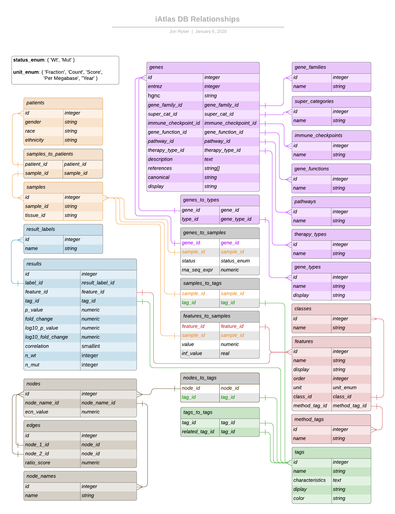

# iAtlas Data Model

The data used in the iAtlas application is tabular data currently stored in a PostgreSQL database. There are script within the project that can automate ghetting data into the database. For this script to work effectively, there are some data conventions that must be followed. This document will outline those conventions.

Please see the diagram at the bottom of this document for a visualization. [Click here to go to the diagram](#data-model-diagram)

## Enums

The database makes use of a couple enumerables. These "enums" are built into the database when it is built and help ensure consistency in some data fields.

The available enums are:

- status_enum:

  `( 'Wt', 'Mut' )`

  This enum represents the status of a gene. Wt = Wild Type, Mut = Mutant

- unit_enum:

  `( 'Fraction', 'Count', 'Score', 'Per Megabase', ''Year' )`

  This enum represents the unit used for the value of the relationship between features.

## Main Data Tables

The data is organized into several "main" data tables. These tables hold data describing specific entities. The data in a specific table should never be aware of how it is being used in another table.

The main tables are:

- ### genes

  Each row describes an individual gene. The genes are primarily identified by [Entrez Id](http://bioportal.bioontology.org/ontologies/EDAM?p=classes&conceptid=data_1027) and secondarily by [HGNC Symbol](https://registry.identifiers.org/registry/hgnc.symbol).

- ### patients

  Each row describes an individual patient.

- ### samples

  Each row describes an individual bio sample.

- ### features

  Each row describes an individual feature.

- ### tags

  Each row describes and individual tag.

  Tags may be used to associate entities. For example, a number of individual samples may be associated with the "TCGA_Study" tag. Further, a number of tags may be with a tag like "TCGA_Study". this allows the entities associated with the initial tags to utlimately be associated with "TCGA_Study" through the initial tags. Instead of thinking of "groups", we can think of tags. This tagging allows us to create groups and hierarchies by association.

- ### results

  Each row describes an individual result.

- ### nodes

  Each row describes an individual node. A node is the relataionship of a gene with a specific tag to the same gene with a different tag or tags.

  Currently, the only value represented is the extra cellular network (ecn_value). Moving forward, other values may be added as new columns.

- ### edges

  Each row describes an individual edge. An edge is a relationship between two [nodes](#nodes).

## Sub Tables

There are many sub tables. These tables contain data that is typically related to a main table. As the information withing the sub table is duplicated many times within the rows of a main table, it makes sense to relate that data in a separate sub table so that it may be better indexed. This also uses the power of the database itself to ensure consistency of these values and helps prevent duplication through human typos.

The sub tables are:

- ### [Genes](#genes) Sub Tables

  - #### gene_functions

    Each row describes an individual gene function.

  - #### gene_families

    Each row describes an individual gene family.

  - #### gene_types

    Each row describes an individual gene type. The current gene types are "immunomodulator", "io_target", "driver_mutation", and "extra_cellular_network".

  - #### pathways

    Each row describes an individual pathway.

  - #### immune_checkpoints

    Each row describes an individual immune checkpoint.

  - #### super_categories

    Each row describes an individual super category.

  - #### therapy_types

    Each row describes an individual therapy type.

- ### [Features](#features) Sub Tables

  - #### classes

    Each row describes an individual class.

  - #### method_tags

    Each row describes an individual method tag.

- ### [Results](#results) Sub Tables

  - #### result_labels

    Each row describes an individual result label.

- ### [Nodes](#nodes) Sub Tables

  - #### node_names

    Each row describes an individual node name.

## Relational (Join) Tables

Much of the data has a one to many or many to many relationship. Rather than have that data expressed in the main tables or sub tables as array structures or similar which would be challenging (and slow) to access, these relationships are kept in join tables that simply hold the ids of the related data. This also makes it indexable as fast integers.

The relational (join) tables are:

- ### sampless_to_patients

  Each row describes a sample to patient relationship.

  For example, "Sample A" may be related to "Patient 1". That would be one row. "Sample B" may also be related to "Patient 1". That would be an additional row.

- ### genes_to_samples

  Each row describes a gene to sample relationship.

  For example, "Gene A" may be related to "Sample A". That would be one row. "Gene B" may also be related to "Sample A". That would be an additional row. "Gene A" may also be related to "Sample B". That would be yet again another row, and so on.

- ### genes_to_types

  Each row describes a gene to gene type relationship.

  For example, "Gene A" may be related to "Type 1". That would be one row. "Gene B" may also be related to "Type 1". That would be an additional row. "Gene A" may also be related to "Type 2". That would be yet again another row, and so on.

- ### tags_to_tags

  Each row describes a tag to tag relationship.

  For example, "Good Tag" may be related to "Parent Tag". That would be one row. "Great Tag" may also be related to "Parent Tag". That would be an additional row. "Good Tag" may also be related to "Sub Tag". That would be yet again another row, and so on.

- ### samples_to_tags

  Each row describes a sample to tag relationship.

  For example, "Sample 1" may be related to "Good Tag". That would be one row. "Sample 2" may also be related to "Good Tag". That would be an additional row. "Sample 1" may also be related to "Sub Tag". That would be yet again another row, and so on.

- ### features_to_samples

  Each row describes a feature to sample relationship.

  For example, "Feature A" may be related to "Sample 1". That would be one row. "Feature B" may also be related to "Sample 1". That would be an additional row. "Feature A" may also be related to "Sample 2". That would be yet again another row, and so on.

- ### nodes_to_tags

  Each row describes a node to tag relationship.

  For example, "Node 1" may be related to "Good Tag". That would be one row. "Node 2" may also be related to "Good Tag". That would be an additional row. "Node 1" may also be related to "Great Tag". That would be yet again another row, and so on.

## Table Fields

The fields in each table represent a specific property of the entities represented by the table.

For example, in the genes table, the fields are properties specifically of a gene. The gene is not aware of the sample it comes from and is not aware of any tag it is associated with. App specific information about the gene should not be contained in the data. If we imagine using this data in many different applications, we see that only data that is specific to the actual gene should be in the gene table.

The following are descriptions of each field in each table. This should be exhaustive.

- [genes](#genes)

  - `id` - A unique database identifier for the specific gene. This is an integer that is generated by the database. (an integer)

  - `entrez` - The unique Entrez Id for this gene. (an integer)

  - `hgnc` - The unique HUGO Id (HGNC Symbol) for this gene. (a string)

  - `gene_family_id` - The database identifier of the gene family associated with this gene. Relates to the `id` field in a row in the [gene_families](#gene_families) sub table. (an integer)

  - `super_cat_id` - The database identifier of the super category associated with this gene. Relates to the `id` field in a row in the [super_categories](#super_categories) sub table. (an integer)

  - `immune_checkpoint_id` - The database identifier of the immune checkpoint associated with this gene. Relates to the `id` field in a row in the [immune_checkpoints](#immune_checkpoints) sub table. (an integer)

  - `gene_function_id` - The database identifier of the gene function associated with this gene. Relates to the `id` field in a row in the [gene_functions](#gene_functions) sub table. (an integer)

  - `pathway_id` - The database identifier of the pathway associated with this gene. Relates to the `id` field in a row in the [pathways](#pathways) sub table. (an integer)

  - `therapy_type_id` - The database identifier of the therapy type associated with this gene. Relates to the `id` field in a row in the [therapy_types](#therapy_types) sub table. (an integer)

  - `description` - A text description of the gene. (a string)

  - `references` - An array of URLs related to this gene. (an array of string)

  - `canonical` - A string that may be used for displaying the gene in a header. (a string)

  - `display` - A human friendly name for the gene. (a string)

- [gene_types](#gene_types)

  - `id` - A unique database identifier for the specific gene type. This is an integer that is generated by the database. (an integer)

  - `name` - The unique name of the gene type. (a string)

  - `display` - A human friendly name for the gene type. (a string)

- [immune_checkpoints](#immune_checkpoints)

  - `id` - A unique database identifier for the specific immune checkpoint. This is an integer that is generated by the database. (an integer)

  - `name` - The unique name of the immune checkpoint. (a string)

- [gene_family](#gene_family)

  - `id` - A unique database identifier for the specific gene family. This is an integer that is generated by the database. (an integer)

  - `name` - The unique name of the gene family. (a string)

- [gene_function](#gene_function)

  - `id` - A unique database identifier for the specific gene function. This is an integer that is generated by the database. (an integer)

  - `name` - The unique name of the gene function. (a string)

- [pathways](#pathways)

  - `id` - A unique database identifier for the specific pathway. This is an integer that is generated by the database. (an integer)

  - `name` - The unique name of the pathway. (a string)

- [super_categories](#super_categories)

  - `id` - A unique database identifier for the specific super category. This is an integer that is generated by the database. (an integer)

  - `name` - The unique name of the super category. (a string)

- [therapy_types](#therapy_types)

  - `id` - A unique database identifier for the specific therapy type. This is an integer that is generated by the database. (an integer)

  - `name` - The unique name of the therapy type. (a string)

- [genes_to_types](#genes_to_types)

  - `gene_id` - The database identifier of a specific gene. Relates to the `id` field in a row in the [genes](#genes) main table. (an integer)

  - `type_id` - The database identifier of a specific gene type. Relates to the `id` field in a row in the [gene_types](#gene_types) sub table. (an integer)

- [patients](#patients)

  - `id` - A unique database identifier for the specific patient. This is an integer that is generated by the database. (an integer)

  - `ethnicity` - The ethnicity of the patient. (a string)

  - `gender` - The gender of the patient. (a string)

  - `race` - The race of the patient. (a string)

- [samples](#samples)

  - `id` - A unique database identifier for the specific sample. This is an integer that is generated by the database. (an integer)

  - `sample_id` - The unique name for the specific sample. (a string)

  - `tissue_id` - The unique tissue id for the specific sample. This may be used to access the sample image. (a string)\
    ie: `https://quip1.bmi.stonybrook.edu:443/camicroscope/osdCamicroscope.php?tissueId={tissue_id}`

- [sampless_to_patients](#sampless_to_patients)

  - `sample_id` - The database identifier of a specific sample. Relates to the `id` field in a row in the [samples](#samples) main table. (an integer)

  - `patient_id` - The database identifier of a specific patient. Relates to the `id` field in a row in the [patients](#patients) main table. (an integer)

- [genes_to_samples](#genes_to_samples)

  - `gene_id` - The database identifier of a specific gene. Relates to the `id` field in a row in the [genes](#genes) main table. (an integer)

  - `sample_id` - The database identifier of a specific sample. Relates to the `id` field in a row in the [samples](#samples) main table. (an integer)

- [results](#results)

  - `id` - A unique database identifier for the specific result. This is an integer that is generated by the database. (an integer)

  - `feature_id` - The database identifier of a specific feature. Relates to the `id` field in a row in the [features](#features) main table. (an integer)

  - `label_id` - The database identifier of the result label associated with this result. Relates to the `id` field in a row in the [result_labels](#result_labels) sub table. (an integer)

  - `tag_id` - The database identifier of the specific tag associated with this result. Relates to the `id` field in a row in the [tags](#tags) main table. (an integer)

  - `p_value` - The p value of the result. (a numeric value)

  - `log10_p_value` - The log base 10 representation of the p value of the result. (a numeric value)

  - `fold_change` - The fold change of the result. (a numeric value)

  - `log10_p_fold_change` - The log base 10 representation of the fold change of the result. (a numeric value)

  - `correlation` - The correlation value of the result. (a smallint)

  - `n_wt` - The number of wild type genes in the result. (an integer)

  - `n_mut` - The number of mutant genes in the result. (an integer)

- [result_labels](#result_labels)

  - `id` - A unique database identifier for the specific result label. This is an integer that is generated by the database. (an integer)

  - `name` - The unique name of the result label. (a string)

- [features](#features)

  - `id` - A unique database identifier for the specific feature. This is an integer that is generated by the database. (an integer)

  - `name` - The unique name for the specific feature. (a string)

  - `display` - A human friendly name for the feature. (a string)

  - `order` - The priority of the feature. This may be used to display features in order. (an integer)

  - `unit` - The priority of the feature. This may be used to display features in order. (a unit_enum)

  - `class_id` - The database identifier of the specific class associated with this feature. Relates to the `id` field in a row in the [classes](#classes) sub table. (an integer)

  - `method_tag_id` - The database identifier of the specific method tag associated with this feature. Relates to the `id` field in a row in the [method_tags](#method_tags) sub table. (an integer)

- [classes](#classes)

  - `id` - A unique database identifier for the specific class. This is an integer that is generated by the database. (an integer)

  - `name` - The unique name for the specific class. (a string)

- [method_tags](#method_tags)

  - `id` - A unique database identifier for the specific method tag. This is an integer that is generated by the database. (an integer)

  - `name` - The unique name for the specific method tag. (a string)

- [tags](#tags)

  - `id` - A unique database identifier for the specific tag. This is an integer that is generated by the database. (an integer)

  - `name` - The unique name for the specific tag. The name field may be used as a friendly short display in some cases or as a canonical for headings in other cases. (a string)

  - `display` - A human friendly name for the tag. The display field may be used as a friendly long display in some cases or left empty and unused in other cases. (a string)

  - `characteristics` - Characteristic details of the tag. (a string)

  - `color` - The [hex triplet](https://en.wikipedia.org/wiki/Web_colors#Hex_triplet) of a color associated with the tag. (a string)

- [tags_to_tags](#tags_to_tags)

  - `tag_id` - The database identifier of a specific tag. Relates to the `id` field in a row in the [tags](#tags) main table. (an integer)

  - `related_tag_id` - The database identifier of a specific tag that is related to the tag represented by the `tag_id` value. Relates to the `id` field in a row in the [tags](#tags) main table. (an integer)

- [samples_to_tags](#samples_to_tags)

  - `sample_id` - The database identifier of a specific gene type. Relates to the `id` field in a row in the [samples](#samples) main table. (an integer)

  - `tag_id` - The database identifier of a specific tag. Relates to the `id` field in a row in the [tags](#tags) main table. (an integer)

- [features_to_samples](#features_to_samples)

  - `sample_id` - The database identifier of a specific sample. Relates to the `id` field in a row in the [samples](#samples) main table. (an integer)

  - `feature_id` - The database identifier of a specific feature. Relates to the `id` field in a row in the [features](#features) main table. (an integer)

- [nodes](#nodes)

  - `id` - A unique database identifier for the specific node. This is an integer that is generated by the database. (an integer)

  - `node_name_id` - The database identifier of a specific node name. Relates to the `id` field in a row in the [node_names](#node_names) sub table. (an integer)

  - `ecn_value` - The extra cellular network value of the specific node. (an integer)

- [nodes_to_tags](#nodes_to_tags)

  - `node_id` - The database identifier of a specific node. Relates to the `id` field in a row in the [nodes](#nodes) main table. (an integer)

  - `tag_id` - The database identifier of a specific tag. Relates to the `id` field in a row in the [tags](#tags) main table. (an integer)

- [edges](#edges)

  - `id` - A unique database identifier for the specific edge. This is an integer that is generated by the database. (an integer)

  - `node_1_id` - The database identifier of a specific node. Relates to the `id` field in a row in the [nodes](#nodes) main table. (an integer)

  - `node_2_id` - The database identifier of a specific node. Relates to the `id` field in a row in the [nodes](#nodes) main table. (an integer)

  - `ratio_score` - The relationship value between the two nodes. (an integer)

## Data Model Diagram

